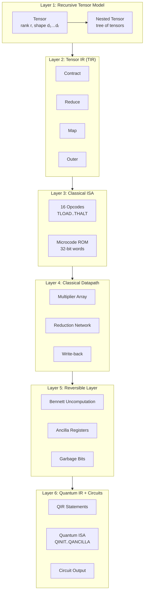
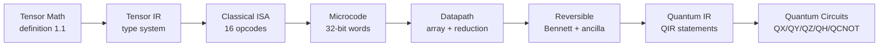
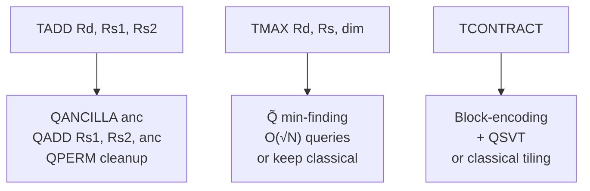

<div align="center">

# sovereign-tensor-quantum

**Recursive Tensor-to-Quantum Architecture · ISA · Microcode · QIR · Reversible Transforms · Complexity Analysis**

[](LICENSE)
[](LICENSE)
[](LICENSE)
[](src/)
[](tests/)

Full-stack formal specification: recursive tensor mathematics → Tensor IR → Classical ISA → Microcode → Classical Datapath → Reversible Layer → Quantum IR → Quantum Circuits.

</div>

---

## Architecture Stack



## Data Flow



## Primitive Operations

| Operation | Symbol | Rank Change | Reversible | Complexity |
|-----------|--------|-------------|------------|------------|
| Contract | ×ₖ | −2 | No* | O(∏d) |
| Reduce | red_f | −1 | No | O(∏d) |
| Map | map_f | 0 | Depends on f | O(∏d) |
| Outer | ⊗ | +ranks | Yes | O(∏d) |
| Add | + | 0 | Yes (ancilla) | O(∏d) |
| Scale | ·α | 0 | Yes | O(∏d) |

*Contraction is information-losing in the general case.

## Classical → Quantum Transformation



## Complexity

| Layer | Time | Space | Qubits | Notes |
|-------|------|-------|--------|-------|
| Classical GEMM | O(N³) | O(N²) | — | Baseline |
| Online softmax | O(N²) | O(N) | — | Source-derived |
| Reversible GEMM | O(N³) | O(N²)+ancilla | — | Bennett |
| Quantum basis | poly | O(N²) qubits | high | No asymptotic win |
| Quantum amplitude | poly log | O(log N) | low | Loading cost dominates |

## File Structure

```
sovereign-tensor-quantum/
├── spec.md                    # Full recursive tensor model + TIR
├── complexity.md              # Complexity analysis + invariants
├── isa/
│   └── isa_spec.md            # 16-opcode classical ISA
├── quantum/
│   ├── quantum_isa.md         # QIR + quantum opcodes
│   └── transform_rules.md     # Classical → quantum rules
├── src/
│   └── recursive_tensor.py    # Reference implementation
└── tests/
    └── test_suite.py          # 7 tests (all passing)
```

## Run Tests

```bash
python tests/test_suite.py
# PASS: tensor scalar
# PASS: tensor vector
# PASS: tensor matrix
# PASS: opcode encode/decode
# PASS: microcode termination
# PASS: online softmax numerical
# PASS: execute empty
```

---

## Topics

`tensor-algebra` `quantum-computing` `ISA-design` `microcode` `reversible-computing` `QIR` `tensor-IR` `formal-spec` `GEMM` `attention` `Bennett-uncomputation` `quantum-circuits` `sovereign`

---

**Sovereign Source License v1.0 + BSL-1.1 + AGPL-3.0 (tri-license)**

Ahmad Ali Parr · Bel Esprit D'Accord Irrevocable Trust · EIN 42-697643
